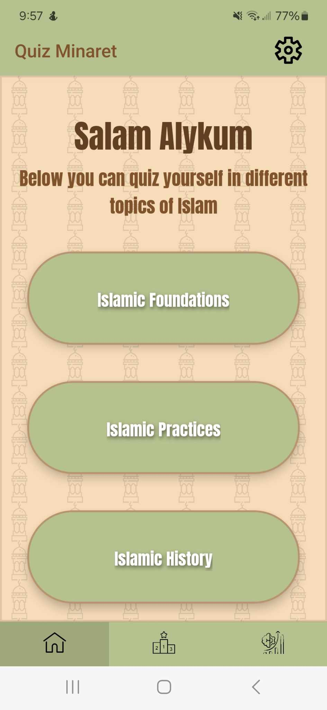
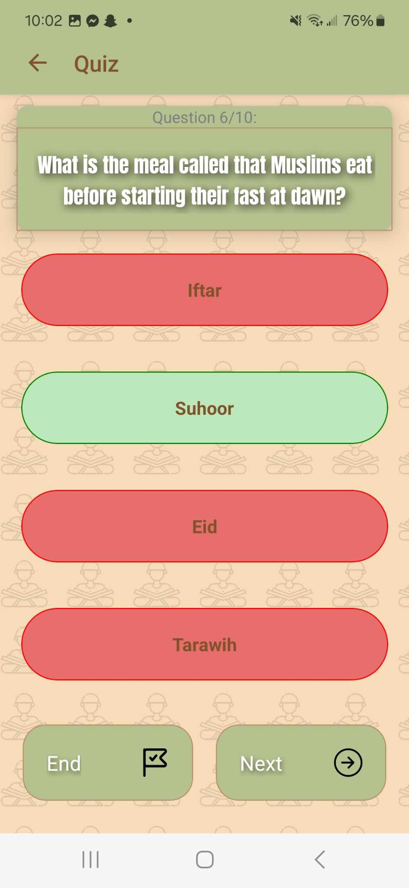
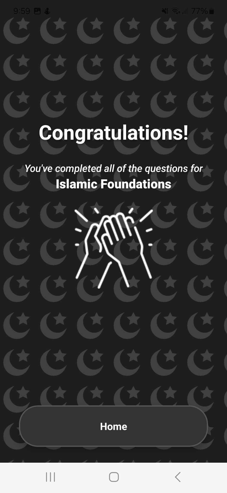
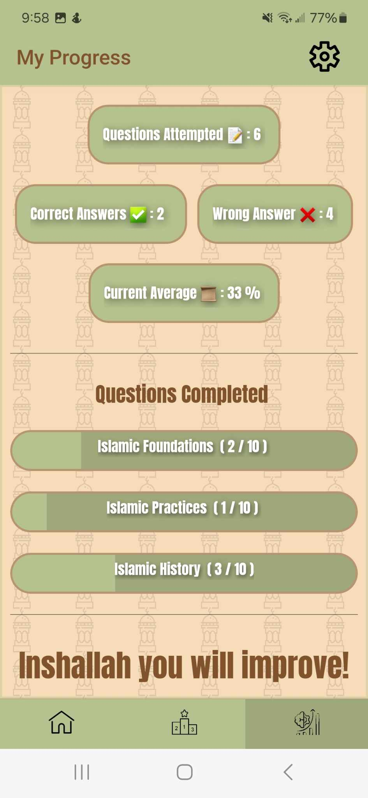
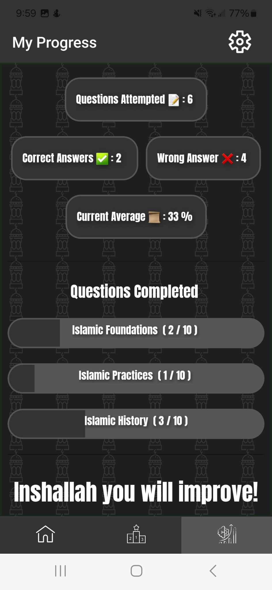
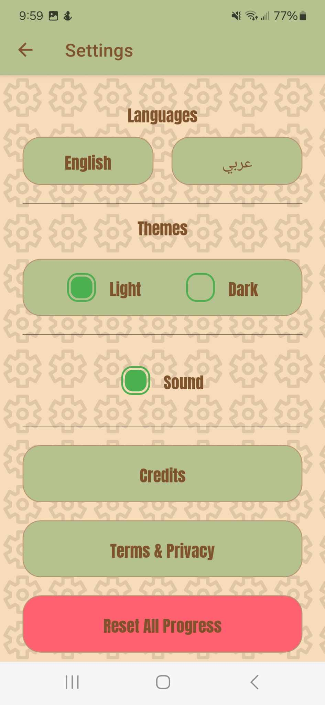

**QuizMinaret** - _"an app to test Muslims & non Muslims knowledge in Islam through various topics"_

**_Little Note_**: This was my first time ever using React Native, and was extremely fun to create, I definitely learned a lot & saw a lot of similarities with React.

Quiz Minaret is a quiz app made for those who are Muslim seeking more knowledge or even those who want to test their knowledge in Islam, the quiz is divided into 3 major sections: Islamic foundation, practices and history and each section includes 100 questions as of now. 

Below are screenshots for the app:

QuizMinaret Home Screen (Showcases the different categories a user can choose to test themself in)

QuizMinaret Quiz Screen (Showcases the typical question & answer format)

QuizMinaret Quiz Results (Showcases the completion of a particular topic)

QuizMinaret Quiz User Progress (Showcases the analytics for quiz questions attempted & such)

QuizMinaret Quiz User Progress in Dark Mode (Showcases the dark theme a user can choose)

QuizMinaret Settings (Showcases the settings for the app where user can choose theme & language, mute sound or not and reset progress)

